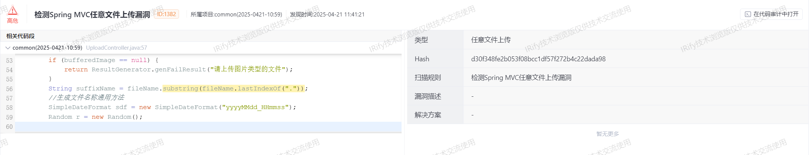
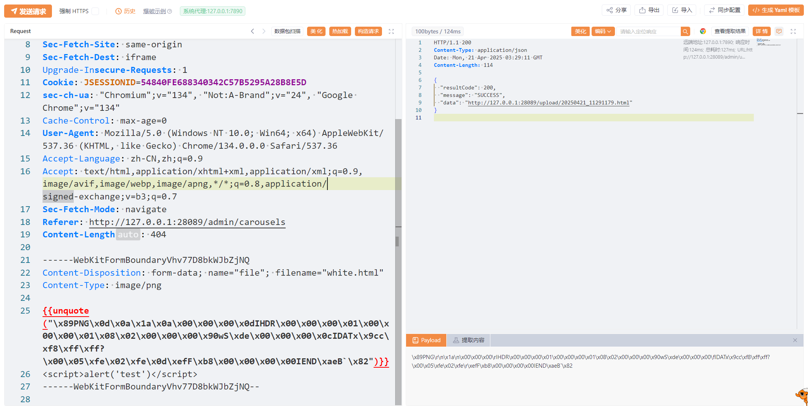
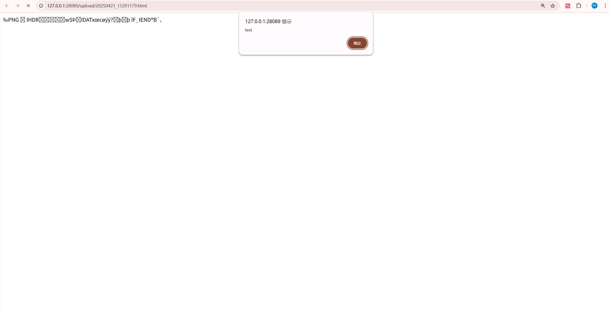

## Title: [arbitary-file-upload] in [newbee-mall] <= [v1.0]

# **BUG_Author:** [intSheep,yaklang. io, IRify]

## Product Information
- **Software Link:** [link](https://github.com/newbee-ltd/newbee-mall)
- **Affected Version:** [<= v1.0]
- **BUG Author:** intSheep,yaklang. io, IRify

## Vulnerability Details
### Vulnerable Files
- `ltd/newbee/mall/controller/common/UploadController.java`

### Vulnerability Type
- Arbitrary File Upload (CWE-434)

### Root Cause
**Insufficient File Type Validation:**
   - The application relies solely on client-side file extension validation
   - No server-side MIME type verification is implemented
   - File extension can be easily manipulated by attackers


```java
// line:57 
 @PostMapping({"/upload/file"})
    @ResponseBody
    public Result upload(HttpServletRequest httpServletRequest, @RequestParam("file") MultipartFile file) throws URISyntaxException, IOException {
        String fileName = file.getOriginalFilename();
        BufferedImage bufferedImage = ImageIO.read(file.getInputStream());
        if (bufferedImage == null) {
            return ResultGenerator.genFailResult("请上传图片类型的文件");
        }
        String suffixName = fileName.substring(fileName.lastIndexOf("."));
        //生成文件名称通用方法
        SimpleDateFormat sdf = new SimpleDateFormat("yyyyMMdd_HHmmss");
        Random r = new Random();
        StringBuilder tempName = new StringBuilder();
        tempName.append(sdf.format(new Date())).append(r.nextInt(100)).append(suffixName);
        String newFileName = tempName.toString();
        File fileDirectory = new File(Constants.FILE_UPLOAD_DIC);
        //创建文件
        File destFile = new File(Constants.FILE_UPLOAD_DIC + newFileName);
        try {
            if (!fileDirectory.exists()) {
                if (!fileDirectory.mkdir()) {
                    throw new IOException("文件夹创建失败,路径为：" + fileDirectory);
                }
            }
            file.transferTo(destFile);
            Result resultSuccess = ResultGenerator.genSuccessResult();
            resultSuccess.setData(NewBeeMallUtils.getHost(new URI(httpServletRequest.getRequestURL() + "")) + "/upload/" + newFileName);
            return resultSuccess;
        } catch (IOException e) {
            e.printStackTrace();
            return ResultGenerator.genFailResult("文件上传失败");
        }
    }
```

### Impact
- Remote Code Execution (RCE) through malicious file upload, leading to complete server compromise
- Unauthorized access to sensitive data and system resources, potentially exposing user information and business data
- System integrity compromise, enabling attackers to modify files, install backdoors, and maintain persistent access


## Description
1. **Vulnerability Details:**
    - In the this php code, username parameter is directly concatenated into SQL statement
    - Both locations contain classic SQL injection vulnerabilities
    - No input validation or escaping mechanisms implemented

2. **Attack Vectors:**
    - Attackers can manipulate SQL query structure using special characters
    - Additional information can be extracted using UNION queries
    - Database information can be obtained through boolean-based blind injection
    - Error-based injection might reveal more information

## Code Scan

this vulnerability find by [IRify](ssa.to) :



## Proof of Concept

this valnerability validation by [Yakit](https://www.yaklang.io/)

1. **Attack Packet**
   
   Fill in the PoC after uploading the content as an image.
```plaintext
POST /admin/upload/file HTTP/1.1
Host: 127.0.0.1:28089
sec-ch-ua-platform: "Windows"
sec-ch-ua-mobile: ?0
Accept-Encoding: gzip, deflate, br, zstd
Content-Type: multipart/form-data; boundary=----WebKitFormBoundaryVhv77D8bkWJbZjNQ
Origin: http://127.0.0.1:28089
Sec-Fetch-Site: same-origin
Sec-Fetch-Dest: iframe
Upgrade-Insecure-Requests: 1
Cookie: JSESSIONID=54840FE688340342C57B5295A28B8E5D
sec-ch-ua: "Chromium";v="134", "Not:A-Brand";v="24", "Google Chrome";v="134"
Cache-Control: max-age=0
User-Agent: Mozilla/5.0 (Windows NT 10.0; Win64; x64) AppleWebKit/537.36 (KHTML, like Gecko) Chrome/134.0.0.0 Safari/537.36
Accept-Language: zh-CN,zh;q=0.9
Accept: text/html,application/xhtml+xml,application/xml;q=0.9,image/avif,image/webp,image/apng,*/*;q=0.8,application/signed-exchange;v=b3;q=0.7
Sec-Fetch-Mode: navigate
Referer: http://127.0.0.1:28089/admin/carousels
Content-Length: 404

------WebKitFormBoundaryVhv77D8bkWJbZjNQ
Content-Disposition: form-data; name="file"; filename="white.html"
Content-Type: image/png

{{unquote("\x89PNG\x0d\x0a\x1a\x0a\x00\x00\x00\x0dIHDR\x00\x00\x00\x01\x00\x00\x00\x01\x08\x02\x00\x00\x00\x90wS\xde\x00\x00\x00\x0cIDATx\x9cc\xf8\xff\xff?\x00\x05\xfe\x02\xfe\x0d\xefF\xb8\x00\x00\x00\x00IEND\xaeB`\x82")}}
<script>alert('test')</script>
------WebKitFormBoundaryVhv77D8bkWJbZjNQ--
```
   
   

## Suggested Repairs
1. Implement File Type Validation
   ```java
   private boolean isValidFileType(String fileName) {
       String[] allowedExtensions = {"jpg", "jpeg", "png", "gif"};
       String extension = fileName.substring(fileName.lastIndexOf(".") + 1).toLowerCase();
       return Arrays.asList(allowedExtensions).contains(extension);
   }
   ```

2. Add Content-Type Verification
   ```java
   private boolean isValidContentType(String contentType) {
       String[] allowedTypes = {"image/jpeg", "image/png", "image/gif"};
       return Arrays.asList(allowedTypes).contains(contentType);
   }
   ```

3. Security Recommendations
    - Store uploaded files outside web root directory
    - Rename files to prevent overwriting and path traversal
    - Implement file size restrictions
    - Add anti-virus scanning for uploaded files
    - Use secure random file names without preserving original extensions
    - Implement proper access controls for uploaded files
    - Set appropriate file permissions (read-only)

## Additional Information
- Refer to OWASP File Upload Security Guide
- Consider using secure file handling libraries
- Implement comprehensive logging for file upload operations
- References:
    - OWASP File Upload Cheat Sheet
    - CWE-434: Unrestricted Upload of File with Dangerous Type
    - OWASP Top 10: A5:2021 – Security Misconfiguration

The severity of this vulnerability is CRITICAL, and immediate remediation is recommended as it poses a serious threat to the system's security.

Mitigation Timeline:
- Immediate: Implement file type validation and content-type verification
- Short-term: Move storage location outside web root and implement proper naming
- Long-term: Develop comprehensive file security strategy with scanning and monitoring

This vulnerability requires immediate attention due to its potential for remote code execution and system compromise. 